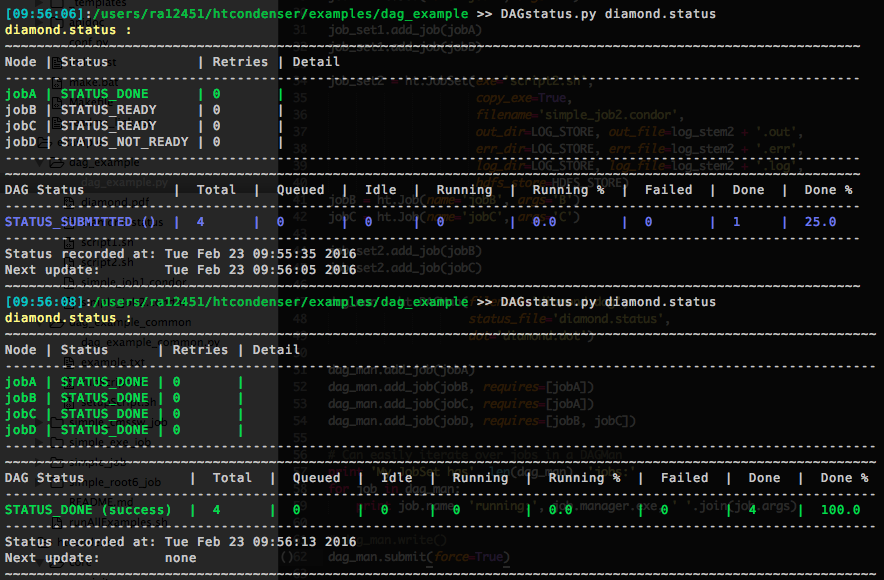

DAGstatus
=========

A handy tool for monitor jobs in a DAG: `DAGStatus <https://github.com/raggleton/htcondenser/blob/master/htcondenser/bin/DAGStatus>`_

Usage
-----
Ensure that the ``DAGMan.status_filename`` attribute is set. Then pass that filename to ``DAGStatus`` to view the current DAG status. Use the ``DAGMan.status_update_period`` attribute to control how often the status file is updated.

If you are not using the ``htcondenser`` library then ensure you have the following line in your DAG description file: ::

    NODE_STATUS_FILE <filename> <refresh interval in seconds>

See `2.10.12 Capturing the Status of Nodes in a File <https://research.cs.wisc.edu/htcondor/manual/current/2_10DAGMan_Applications.html#SECTION0031012000000000000000>`_ for more details.

General usage instructions:::

    usage: DAGStatus [-h] [-v] [-s] [statusFile [statusFile ...]]

    Code to present the DAGman status output in a more user-friendly manner. Add
    this directory to PATH to run DAGStatus it from anywhere.

    positional arguments:
      statusFile     name(s) of DAG status file(s), separated by spaces

    optional arguments:
      -h, --help     show this help message and exit
      -v, --verbose  enable debugging mesages
      -s, --summary  only printout very short summary of all jobs

Customisation
-------------

It is possible to customise the coloured output to suit your personal preferences. This is done in `DAGstatus_config.json <https://github.com/raggleton/htcondenser/blob/master/htcondenser/bin/DAGStatus_config.json>`_.
The user must define any colours or styles used in the ``colors`` object. These can then be used in the ``statuses`` and ``formatting`` objects. Any combination of colours/styles can be used, by concatenating with a ``+``.

Note that concatenating two colours will only use the rightmost colour.
