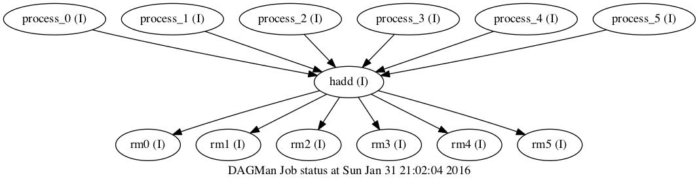

FAQ
===

**Can a DAG have 1 node/Job?**

Yes. You can still have the advantages of auto-retry, ``DAGStatus`` monitoring, and other DAG options.

**What are some cool uses of DAGs?**

In addition to the 1-node DAG, you can submit multiple "layers" of processing one go.

For example: say you want to run analysis code over many input files, then ``hadd`` the files, and finally delete all the intermediate files.
This is achievable with a DAG that looks like this:

